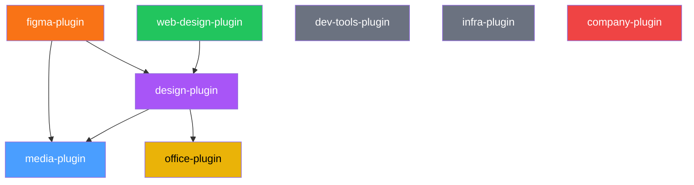

# claude-my-marketplace

[](https://github.com/lukaskellerstein/claude-my-marketplace)
[](plugins/)
[](https://docs.anthropic.com/en/docs/claude-code)

> A curated collection of [Claude Code](https://docs.anthropic.com/en/docs/claude-code) plugins for design, development, documentation, media generation, and infrastructure management.

This marketplace bundles **8 plugins** with **30+ skills**, **10+ specialized agents**, and multiple MCP server integrations — giving Claude Code capabilities spanning the full software development lifecycle from design to deployment.

## Plugins

### [company-plugin](plugins/company-plugin) `v1.0.0`

Business operations toolkit — shipping logistics via Zásilkovna (Czech) and DHL (worldwide), and payment processing via Stripe.

- **Skills:** zasilkovna, dhl, stripe
- **MCP:** DHL API Assistant, Stripe

### [dev-tools-plugin](plugins/dev-tools-plugin) `v1.2.0`

General developer tooling — git workflows, code hygiene, dependency management, spec-driven development, and project documentation generation.

- **Skills:** git-pr, dead-code, update-dependencies, sync-spec-kit, update-docs, update-feature-docs, update-readme
- **Agents:** dead-code-analyzer, sync-spec-kit-agent

### [office-plugin](plugins/office-plugin) `v5.0.0`

Office document generation — professional PowerPoint presentations, Word documents, and Excel spreadsheets.

- **Skills:** pptx, docx, xlsx

### [infra-plugin](plugins/infra-plugin) `v1.0.0`

Infrastructure management for Kubernetes/GKE, Istio, Helm, Terraform, Traefik, and authentication (Keycloak, OAuth2-proxy).

- **Skills:** auth, helm, istio, kubernetes, terraform, traefik

### [media-plugin](plugins/media-plugin) `v1.5.0`

AI-powered media generation — images, videos/GIFs, music, text-to-speech, and data visualizations (charts, graphs, diagrams, maps) via Google Gemini, ElevenLabs, D3.js, and Mermaid. Also supports sourcing stock photos and fetching pre-made SVG icons.

- **Skills:** image-generation, image-sourcing, video-generation, music-generation, speech-generation, icon-library, graph-generation
- **Agents:** media-director
- **MCP:** media-mcp (Gemini), ElevenLabs, Mermaid Chart, Playwright

### [design-plugin](plugins/design-plugin) `v1.1.0`

Design direction and creative guidance — the "taste layer" that makes AI-assisted design intentional rather than generic. Styleguides, aesthetic strategy, typography pairings, color mood systems, media prompt crafting, and design review.

- **Skills:** styleguide, frontend-aesthetics, media-prompt-craft, design-review, design-system
- **Agents:** design-director
- **Commands:** /design

### [web-design-plugin](plugins/web-design-plugin) `v1.5.9`

End-to-end website/webapp design and implementation — from brief to working React/Vite code. Orchestrates design direction, content architecture, media generation, parallel per-page implementation, and visual testing with an opinionated anti-slop workflow.

- **Skills:** animation-system, page-architecture, css-architecture, variation
- **Agents:** page-builder, scaffold-builder, assembler, variation-generator, visual-fixer-app, visual-fixer-page, design-doc-foundation, design-doc-animation, design-doc-data, design-doc-media, design-doc-pages
- **Commands:** /web-design
- **MCP:** Playwright

## Architecture

### Plugin Dependencies



- **media-plugin** is foundational — used by figma and design plugins for image/video/music/speech generation, icon sourcing, and data visualizations
- **design-plugin** provides creative direction — used by figma-plugin and web-design-plugin for design system auditing and styleguides
- **web-design-plugin** uses design-plugin skills for aesthetic direction, styleguides, and design review
- **office-plugin** is used by design-plugin for PPTX image dimension references
- **dev-tools-plugin**, **infra-plugin**, and **company-plugin** are standalone with no cross-plugin dependencies

### MCP Server Integrations

| Plugin | MCP Server | Purpose |
|--------|-----------|---------|
| media-plugin | `media-mcp` (uvx) | AI media generation via Google Gemini |
| media-plugin | `elevenlabs-mcp` (uvx) | Text-to-speech and voice cloning |
| media-plugin | Mermaid Chart (HTTP) | Diagram generation |
| media-plugin | Playwright (npx) | D3.js chart rendering |
| figma-plugin | Playwright (npx) | Figma Plugin API automation |
| web-design-plugin | Playwright (npx) | Visual testing of built websites |
| company-plugin | DHL API Assistant (HTTP) | DHL shipment tracking, parcel shipping, returns |
| company-plugin | `@stripe/mcp` (npx) | Stripe payments, subscriptions, invoicing |

## Installation

### 1. Add the marketplace

Add this repository as a plugin marketplace using the `/plugin` slash command inside Claude Code:

```
/plugin marketplace add lukaskellerstein/claude-my-marketplace
```

Or via the CLI:

```bash
claude plugin marketplace add lukaskellerstein/claude-my-marketplace
```

### 2. Install a plugin

Once the marketplace is added, install individual plugins:

```
/plugin install dev-tools-plugin@claude-my-marketplace
/plugin install office-plugin@claude-my-marketplace
/plugin install company-plugin@claude-my-marketplace
/plugin install infra-plugin@claude-my-marketplace
/plugin install figma-plugin@claude-my-marketplace
/plugin install media-plugin@claude-my-marketplace
/plugin install design-plugin@claude-my-marketplace
/plugin install web-design-plugin@claude-my-marketplace
```

### 3. Update

To pull the latest versions:

```
/plugin marketplace update
```

## Environment Variables

The **media-plugin** and **company-plugin** require environment variables. All other plugins work without any configuration.

### media-plugin

| Variable | Required | Description |
|---|---|---|
| `GEMINI_API_KEY` | **Yes** | Google Gemini API key for image, video, and music generation via the `media-mcp` server. Get one at [aistudio.google.com](https://aistudio.google.com/apikey). |
| `ELEVENLABS_API_KEY` | **Yes** | ElevenLabs API key for text-to-speech, voice cloning, and audio tools. Get one at [elevenlabs.io](https://elevenlabs.io). |
| `MEDIA_OUTPUT_DIR` | Recommended | Absolute path where generated media files are saved. When set, MCP servers return file paths instead of base64 data, keeping the conversation context clean. Falls back to the current directory if unset. |

### company-plugin

| Variable | Required | Description |
|---|---|---|
| `DHL_API_KEY` | **Yes** | DHL API key for the DHL API Assistant MCP server. Get one at [developer.dhl.com](https://developer.dhl.com). |
| `STRIPE_SECRET_KEY` | **Yes** | Stripe secret API key for the Stripe MCP server. Use `sk_test_...` keys for development. Get one at [dashboard.stripe.com](https://dashboard.stripe.com). |
| `ZASILKOVNA_API_KEY` | **Yes** | Zásilkovna (Packeta) API password for shipment operations. Get one from the Zásilkovna client section. |

### Setup by OS

#### macOS / Linux (bash)

Add to your `~/.bashrc`, `~/.bash_profile`, or `~/.zshrc`:

```bash
export GEMINI_API_KEY="your-gemini-api-key"
export ELEVENLABS_API_KEY="your-elevenlabs-api-key"
export MEDIA_OUTPUT_DIR="/path/to/media/output"
export DHL_API_KEY="your-dhl-api-key"
export STRIPE_SECRET_KEY="sk_test_your-stripe-secret-key"
export ZASILKOVNA_API_KEY="your-zasilkovna-api-key"
```

Then reload your shell:

```bash
source ~/.bashrc   # or ~/.zshrc
```

#### Windows (PowerShell)

Set permanently for your user via PowerShell:

```powershell
[System.Environment]::SetEnvironmentVariable("GEMINI_API_KEY", "your-gemini-api-key", "User")
[System.Environment]::SetEnvironmentVariable("ELEVENLABS_API_KEY", "your-elevenlabs-api-key", "User")
[System.Environment]::SetEnvironmentVariable("MEDIA_OUTPUT_DIR", "C:\path\to\media\output", "User")
[System.Environment]::SetEnvironmentVariable("DHL_API_KEY", "your-dhl-api-key", "User")
[System.Environment]::SetEnvironmentVariable("STRIPE_SECRET_KEY", "sk_test_your-stripe-secret-key", "User")
[System.Environment]::SetEnvironmentVariable("ZASILKOVNA_API_KEY", "your-zasilkovna-api-key", "User")
```

Then restart your terminal for changes to take effect.

#### Windows (Command Prompt)

Set permanently via `setx`:

```cmd
setx GEMINI_API_KEY "your-gemini-api-key"
setx ELEVENLABS_API_KEY "your-elevenlabs-api-key"
setx MEDIA_OUTPUT_DIR "C:\path\to\media\output"
setx DHL_API_KEY "your-dhl-api-key"
setx STRIPE_SECRET_KEY "sk_test_your-stripe-secret-key"
setx ZASILKOVNA_API_KEY "your-zasilkovna-api-key"
```

Then restart your terminal for changes to take effect.

## Author

Lukas Kellerstein
