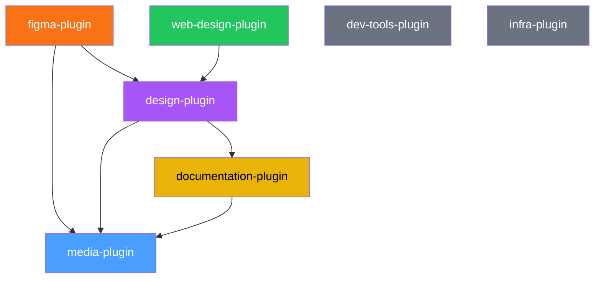

# claude-my-marketplace

[](https://github.com/lukaskellerstein/claude-my-marketplace)
[](plugins/)
[](https://docs.anthropic.com/en/docs/claude-code)

> A curated collection of [Claude Code](https://docs.anthropic.com/en/docs/claude-code) plugins for design, development, documentation, media generation, and infrastructure management.

This marketplace bundles **7 plugins** with **30+ skills**, **10+ specialized agents**, and multiple MCP server integrations — giving Claude Code capabilities spanning the full software development lifecycle from design to deployment.

## Plugins

### [dev-tools-plugin](plugins/dev-tools-plugin) `v1.1.0`

General developer tooling — git workflows, code hygiene, dependency management, and spec-driven development.

- **Skills:** git-pr, dead-code, update-dependencies, sync-spec-kit
- **Agents:** dead-code-analyzer, sync-spec-kit-agent

### [documentation-plugin](plugins/documentation-plugin) `v4.2.0`

Documentation and Office document generation — architecture docs, Mermaid diagrams, D3.js charts, and professional PPTX/DOCX/XLSX files.

- **Skills:** update-docs, update-feature-docs, update-readme, graph-generation, pptx, docx, xlsx
- **MCP:** Mermaid Chart, Playwright

### [infra-plugin](plugins/infra-plugin) `v1.0.0`

Infrastructure management for Kubernetes/GKE, Istio, Helm, Terraform, Traefik, and authentication (Keycloak, OAuth2-proxy).

- **Skills:** auth, helm, istio, kubernetes, terraform, traefik

### [figma-plugin](plugins/figma-plugin) `v3.1.0`

Design and Figma integration — automate Figma via Plugin API in the browser, extract design tokens, generate code from designs, and reproduce websites in Figma.

- **Skills:** figma-bridge, figma-rest-api, design-tokens, design-to-code, web-to-figma
- **Agents:** media-creator, design-structure
- **Commands:** /figma
- **MCP:** Playwright

### [media-plugin](plugins/media-plugin) `v1.4.0`

AI-powered media generation — images, videos/GIFs, music, and text-to-speech via Google Gemini and ElevenLabs. Also supports sourcing stock photos from Unsplash, Pexels, Pixabay, and fetching pre-made SVG icons from Lucide, Heroicons, and Tabler.

- **Skills:** image-generation, image-sourcing, video-generation, music-generation, speech-generation, icon-library
- **Agents:** media-director
- **MCP:** media-mcp (Gemini), ElevenLabs

### [design-plugin](plugins/design-plugin) `v1.1.0`

Design direction and creative guidance — the "taste layer" that makes AI-assisted design intentional rather than generic. Styleguides, aesthetic strategy, typography pairings, color mood systems, media prompt crafting, and design review.

- **Skills:** styleguide, frontend-aesthetics, media-prompt-craft, design-review, design-system
- **Agents:** design-director
- **Commands:** /design

### [web-design-plugin](plugins/web-design-plugin) `v1.5.9`

End-to-end website/webapp design and implementation — from brief to working React/Vite code. Orchestrates design direction, content architecture, media generation, parallel per-page implementation, and visual testing with an opinionated anti-slop workflow.

- **Skills:** animation-system, page-architecture, css-architecture, variation
- **Agents:** page-builder, scaffold-builder, assembler, variation-generator, visual-fixer-app, visual-fixer-page, design-doc-foundation, design-doc-animation, design-doc-data, design-doc-media, design-doc-pages
- **Commands:** /web-design
- **MCP:** Playwright

## Architecture

### Plugin Dependencies



- **media-plugin** is foundational — used by figma, design, and documentation plugins for image/video/music/speech generation and icon sourcing
- **design-plugin** provides creative direction — used by figma-plugin and web-design-plugin for design system auditing and styleguides
- **web-design-plugin** uses design-plugin skills for aesthetic direction, styleguides, and design review
- **documentation-plugin** is used by design-plugin for PPTX image dimension references
- **dev-tools-plugin** and **infra-plugin** are standalone with no cross-plugin dependencies

### MCP Server Integrations

| Plugin | MCP Server | Purpose |
|--------|-----------|---------|
| media-plugin | `media-mcp` (uvx) | AI media generation via Google Gemini |
| media-plugin | `elevenlabs-mcp` (uvx) | Text-to-speech and voice cloning |
| documentation-plugin | Mermaid Chart (HTTP) | Diagram generation |
| documentation-plugin | Playwright (npx) | D3.js chart rendering |
| figma-plugin | Playwright (npx) | Figma Plugin API automation |
| web-design-plugin | Playwright (npx) | Visual testing of built websites |

## Installation

### 1. Add the marketplace

Add this repository as a plugin marketplace using the `/plugin` slash command inside Claude Code:

```
/plugin marketplace add lukaskellerstein/claude-my-marketplace
```

Or via the CLI:

```bash
claude plugin marketplace add lukaskellerstein/claude-my-marketplace
```

### 2. Install a plugin

Once the marketplace is added, install individual plugins:

```
/plugin install dev-tools-plugin@claude-my-marketplace
/plugin install documentation-plugin@claude-my-marketplace
/plugin install infra-plugin@claude-my-marketplace
/plugin install figma-plugin@claude-my-marketplace
/plugin install media-plugin@claude-my-marketplace
/plugin install design-plugin@claude-my-marketplace
/plugin install web-design-plugin@claude-my-marketplace
```

### 3. Update

To pull the latest versions:

```
/plugin marketplace update
```

## Environment Variables

Only the **media-plugin** requires environment variables. All other plugins work without any configuration.

### media-plugin

| Variable | Required | Description |
|---|---|---|
| `GEMINI_API_KEY` | **Yes** | Google Gemini API key for image, video, and music generation via the `media-mcp` server. Get one at [aistudio.google.com](https://aistudio.google.com/apikey). |
| `ELEVENLABS_API_KEY` | **Yes** | ElevenLabs API key for text-to-speech, voice cloning, and audio tools. Get one at [elevenlabs.io](https://elevenlabs.io). |
| `MEDIA_OUTPUT_DIR` | Recommended | Absolute path where generated media files are saved. When set, MCP servers return file paths instead of base64 data, keeping the conversation context clean. Falls back to the current directory if unset. |

### Setup by OS

#### macOS / Linux (bash)

Add to your `~/.bashrc`, `~/.bash_profile`, or `~/.zshrc`:

```bash
export GEMINI_API_KEY="your-gemini-api-key"
export ELEVENLABS_API_KEY="your-elevenlabs-api-key"
export MEDIA_OUTPUT_DIR="/path/to/media/output"
```

Then reload your shell:

```bash
source ~/.bashrc   # or ~/.zshrc
```

#### Windows (PowerShell)

Set permanently for your user via PowerShell:

```powershell
[System.Environment]::SetEnvironmentVariable("GEMINI_API_KEY", "your-gemini-api-key", "User")
[System.Environment]::SetEnvironmentVariable("ELEVENLABS_API_KEY", "your-elevenlabs-api-key", "User")
[System.Environment]::SetEnvironmentVariable("MEDIA_OUTPUT_DIR", "C:\path\to\media\output", "User")
```

Then restart your terminal for changes to take effect.

#### Windows (Command Prompt)

Set permanently via `setx`:

```cmd
setx GEMINI_API_KEY "your-gemini-api-key"
setx ELEVENLABS_API_KEY "your-elevenlabs-api-key"
setx MEDIA_OUTPUT_DIR "C:\path\to\media\output"
```

Then restart your terminal for changes to take effect.

## Author

Lukas Kellerstein
