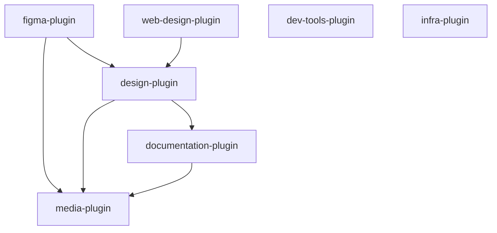

# claude-my-marketplace

A collection of [Claude Code](https://docs.anthropic.com/en/docs/claude-code) plugins providing reusable skills, agents, and commands across projects.

## Plugins

### [dev-tools-plugin](plugins/dev-tools-plugin)

General developer tooling — git workflows, code hygiene, dependency management, and spec-driven development.

- **Skills:** git-pr, dead-code, update-dependencies, sync-spec-kit
- **Agents:** dead-code-analyzer

### [documentation-plugin](plugins/documentation-plugin)

Documentation and Office document generation — architecture docs, Mermaid diagrams, D3.js charts, and professional PPTX/DOCX/XLSX files.

- **Skills:** update-docs, update-feature-docs, update-readme, graph-generation, pptx, docx, xlsx
- **MCP:** Mermaid Chart, Playwright

### [infra-plugin](plugins/infra-plugin)

Infrastructure management for Kubernetes/GKE, Istio, Helm, Terraform, Traefik, and authentication (Keycloak, OAuth2-proxy).

- **Skills:** auth, helm, istio, kubernetes, terraform, traefik

### [figma-plugin](plugins/figma-plugin)

Design and Figma integration — automate Figma via Plugin API in the browser, extract design tokens, and generate code from designs.

- **Skills:** figma-bridge, figma-rest-api, design-tokens, design-to-code
- **Agents:** media-creator, design-structure
- **Commands:** /figma
- **MCP:** Playwright

### [media-plugin](plugins/media-plugin)

AI-powered media generation — images, videos/GIFs, music, and text-to-speech via Google Gemini and ElevenLabs. Also supports sourcing stock photos from Unsplash, Pexels, Pixabay, and fetching pre-made SVG icons from Lucide, Heroicons, and Tabler.

- **Skills:** image-generation, image-sourcing, video-generation, music-generation, speech-generation, icon-library
- **Agents:** media-director
- **MCP:** media-mcp (Gemini), ElevenLabs

### [design-plugin](plugins/design-plugin)

Design direction and creative guidance — the "taste layer" that makes AI-assisted design intentional rather than generic. Styleguides, aesthetic strategy, typography pairings, color mood systems, media prompt crafting, and design review.

- **Skills:** styleguide, frontend-aesthetics, media-prompt-craft, design-review, design-system
- **Agents:** design-director
- **Commands:** /design

### [web-design-plugin](plugins/web-design-plugin)

End-to-end website/webapp design and implementation — from brief to working React/Vite code. Orchestrates design direction, content architecture, media generation, parallel per-page implementation, and visual testing with an opinionated anti-slop workflow.

- **Skills:** animation-system, page-architecture, css-architecture, variation
- **Agents:** web-design-orchestrator, page-builder, scaffold-builder, assembler, variation-generator, visual-tester, design-documenter
- **Commands:** /web-design
- **MCP:** Playwright

## Plugin Dependencies



- **media-plugin** is foundational — used by figma, design, and documentation plugins for image/video/music/speech generation and icon sourcing
- **design-plugin** provides creative direction — used by figma-plugin and web-design-plugin for design system auditing and styleguides
- **web-design-plugin** uses design-plugin skills for aesthetic direction, styleguides, and design review
- **documentation-plugin** is used by design-plugin for PPTX image dimension references
- **dev-tools-plugin** and **infra-plugin** are standalone with no cross-plugin dependencies

## Installation

### 1. Add the marketplace

Add this repository as a plugin marketplace using the `/plugin` slash command inside Claude Code:

```
/plugin marketplace add lukaskellerstein/claude-my-marketplace
```

Or via the CLI:

```bash
claude plugin marketplace add lukaskellerstein/claude-my-marketplace
```

### 2. Install a plugin

Once the marketplace is added, install individual plugins:

```
/plugin install dev-tools-plugin@claude-my-marketplace
/plugin install documentation-plugin@claude-my-marketplace
/plugin install infra-plugin@claude-my-marketplace
/plugin install figma-plugin@claude-my-marketplace
/plugin install media-plugin@claude-my-marketplace
/plugin install design-plugin@claude-my-marketplace
/plugin install web-design-plugin@claude-my-marketplace
```

### 3. Update

To pull the latest versions:

```
/plugin marketplace update
```

## Author

Lukas Kellerstein
