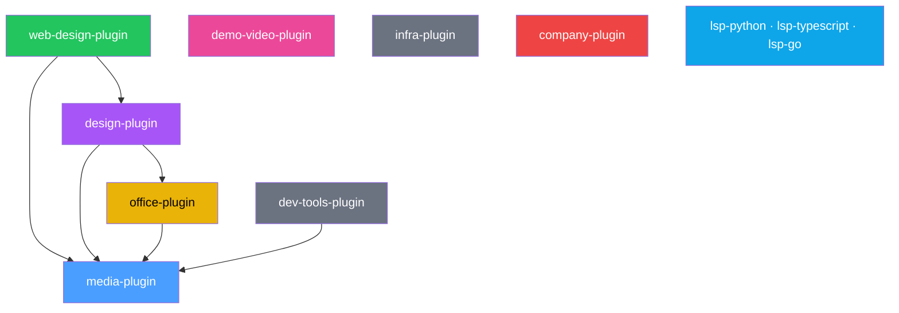

# claude-my-marketplace

[](https://github.com/lukaskellerstein/claude-my-marketplace)
[](plugins/)
[](plugins/)
[](https://code.claude.com/docs)

> A curated collection of [Claude Code](https://code.claude.com/docs) plugins for design, development, documentation, media generation, video production, and infrastructure management.

This marketplace bundles **11 plugins** contributing **45 skills**, **19 agents**, **4 commands**, **9 MCP servers**, and **3 LSP servers** — capabilities spanning the software development lifecycle from design direction through implementation, documentation, deployment, and demo video production.

## Features

- **Design → code, end to end** — creative direction, styleguides and design systems (`design-plugin`) feeding a parallel per-page React/Vite build with visual testing (`web-design-plugin`)
- **Media generation** — images, video, music, speech, icons, charts and diagrams behind a single visual-planning gate (`media-plugin`)
- **Automated demo videos** — repo → storyboard → recorded UI take → voiceover → rendered cut (`demo-video-plugin`)
- **Developer workflow** — autonomous multi-repo PR flow, dead-code sweeps, dependency upgrades, docs and README generation (`dev-tools-plugin`)
- **Infrastructure** — Kubernetes/GKE, Istio, Helm, Terraform, Traefik and Keycloak/OAuth2-proxy auth (`infra-plugin`)
- **Office documents** — PowerPoint, Word and Excel generation (`office-plugin`)
- **Business operations** — Zásilkovna shipping and Stripe payments (`company-plugin`)
- **Opt-in code intelligence** — per-language LSP navigation loaded per session, never globally (`lsp-python`, `lsp-typescript`, `lsp-go`)

## Plugins

| Plugin | Version | What it does | Skills | Agents |
|---|---|---|---|---|
| [media-plugin](plugins/media-plugin) | `v1.15.0` | Image, video, music, speech, icon and data-viz generation | 10 | 1 |
| [web-design-plugin](plugins/web-design-plugin) | `v1.5.11` | Brief → working React/Vite site | 4 | 11 |
| [dev-tools-plugin](plugins/dev-tools-plugin) | `v1.3.0` | Git, code hygiene, deps, docs | 8 | 2 |
| [demo-video-plugin](plugins/demo-video-plugin) | `v1.0.1` | Repo → narrated demo video | 8 | 4 |
| [infra-plugin](plugins/infra-plugin) | `v1.1.0` | K8s, Istio, Helm, Terraform, auth | 6 | — |
| [design-plugin](plugins/design-plugin) | `v1.2.0` | Creative direction and design review | 4 | 1 |
| [office-plugin](plugins/office-plugin) | `v5.0.2` | PPTX, DOCX, XLSX generation | 3 | — |
| [company-plugin](plugins/company-plugin) | `v1.1.0` | Shipping and payments | 2 | — |
| [lsp-python](plugins/lsp-python) | `v1.0.0` | Python navigation via basedpyright | — | — |
| [lsp-typescript](plugins/lsp-typescript) | `v1.0.0` | TS/JS navigation via vtsls | — | — |
| [lsp-go](plugins/lsp-go) | `v1.0.0` | Go navigation via gopls | — | — |

### [media-plugin](plugins/media-plugin) `v1.15.0`

Media generation and manipulation — images, videos/GIFs, music, text-to-speech, and data visualizations (charts, graphs, diagrams, maps) via Google Gemini, ElevenLabs, D3.js, Mermaid and Draw.io. A single visual-planning gate plus `media-prompt-craft` ensure every asset is clarified, styled and reviewed before it is produced.

- **Skills:** visual-planning, media-prompt-craft, image-generation, image-sourcing, video-generation, music-generation, speech-generation, icon-library, graph-generation, svg-mastery
- **Agents:** media-director
- **Commands:** `/media-generate`, `/media-assets`
- **MCP:** media-mcp (Gemini), ElevenLabs, Mermaid, Draw.io, Playwright

### [web-design-plugin](plugins/web-design-plugin) `v1.5.11`

End-to-end website/webapp design and implementation — from brief to working React/Vite code. Orchestrates design direction, content architecture, media generation, parallel per-page implementation and visual testing with an opinionated anti-slop workflow.

- **Skills:** animation-system, page-architecture, css-architecture, variation
- **Agents:** page-builder, scaffold-builder, assembler, variation-generator, visual-fixer-app, visual-fixer-page, design-doc-foundation, design-doc-animation, design-doc-data, design-doc-media, design-doc-pages
- **Commands:** `/web-design`
- **MCP:** Playwright

### [dev-tools-plugin](plugins/dev-tools-plugin) `v1.3.0`

General developer tooling — git workflows, code hygiene, dependency management, spec-kit synchronization and project documentation generation. `git-pr` runs the whole commit → PR → squash-merge → back-to-main round trip across every repo in a folder, autonomously.

- **Skills:** brainstorm, git-pr, dead-code, update-dependencies, sync-spec-kit, update-docs, update-feature-docs, update-readme
- **Agents:** dead-code-analyzer, sync-spec-kit-agent

### [demo-video-plugin](plugins/demo-video-plugin) `v1.0.1`

Turns a project repo into a narrated, edited demo video. Reads the codebase, writes a storyboard, prepares deterministic demo state, drives the UI with Playwright (web **and** Electron) recording one clip per section, generates ElevenLabs voiceover, reconciles *measured* durations into a timeline, and renders the final cut with Remotion. See its [README](plugins/demo-video-plugin/README.md) for the pipeline.

- **Skills:** demo-video, demo-setup, demo-scripting, demo-app-prep, demo-capture, demo-voiceover, demo-assembly, demo-review
- **Agents:** demo-capture-operator, demo-frame-critic, demo-remotion-builder, demo-researcher
- **MCP:** Playwright (demo capture), ElevenLabs
- **Hooks:** clip post-processing, audio probing, artifact validation

### [infra-plugin](plugins/infra-plugin) `v1.1.0`

Infrastructure management for Kubernetes/GKE, Istio service mesh, and authentication (Keycloak, OAuth2-proxy). Includes Helm charts, Terraform IaC and Traefik reverse proxy.

- **Skills:** auth, helm, istio, kubernetes, terraform, traefik

### [design-plugin](plugins/design-plugin) `v1.2.0`

Design direction and creative guidance — the "taste layer" that makes AI-assisted design intentional rather than generic. Styleguides, aesthetic strategy, typography pairings, color mood systems and design review.

- **Skills:** styleguide, frontend-aesthetics, design-review, design-system
- **Agents:** design-director
- **Commands:** `/design`

### [office-plugin](plugins/office-plugin) `v5.0.2`

Office document generation — professional PowerPoint presentations, polished Word documents and Excel spreadsheets.

- **Skills:** pptx, docx, xlsx

### [company-plugin](plugins/company-plugin) `v1.1.0`

Business operations toolkit — shipping logistics via Zásilkovna (Packeta) and payment processing via Stripe.

- **Skills:** zasilkovna, stripe
- **MCP:** Stripe

### LSP plugins

[lsp-python](plugins/lsp-python), [lsp-typescript](plugins/lsp-typescript), [lsp-go](plugins/lsp-go) — all `v1.0.0`. Manifest-only plugins giving Claude real code navigation — go to definition, find references, hover types — one plugin per language.

| Plugin | Server | Extensions | Requires on `PATH` |
|---|---|---|---|
| lsp-python | basedpyright | `.py`, `.pyi` | `uv tool install basedpyright` |
| lsp-typescript | vtsls | `.ts`, `.tsx`, `.js`, `.jsx` | `npm i -g @vtsls/language-server` |
| lsp-go | gopls | `.go` | `go install golang.org/x/tools/gopls@latest` |

> [!IMPORTANT]
> **Do not `/plugin install` these.** They are meant to be loaded **per session**, not enabled globally — see [Using the LSP plugins](#using-the-lsp-plugins).

## Architecture


```mermaid
graph TD
    webdesign[web-design-plugin] --> design[design-plugin]
    webdesign --> media[media-plugin]
    design --> media
    design --> office[office-plugin]
    office --> media
    dev[dev-tools-plugin] --> media
    demo[demo-video-plugin]
    infra[infra-plugin]
    company[company-plugin]
    lsp["lsp-python · lsp-typescript · lsp-go"]

    style media fill:#4a9eff,color:#fff
    style design fill:#a855f7,color:#fff
    style webdesign fill:#22c55e,color:#fff
    style office fill:#eab308,color:#000
    style demo fill:#ec4899,color:#fff
    style dev fill:#6b7280,color:#fff
    style infra fill:#6b7280,color:#fff
    style company fill:#ef4444,color:#fff
    style lsp fill:#0ea5e9,color:#fff
```

- **media-plugin** is foundational — design, web-design, office and dev-tools all route asset generation through it
- **design-plugin** provides creative direction, consumed by web-design-plugin for styleguides and design review
- **office-plugin** uses media-plugin for slide imagery; media-plugin references it back for PPTX dimensions
- **demo-video-plugin**, **infra-plugin**, **company-plugin** and the **LSP plugins** are standalone

### Commands

| Plugin | Command | Purpose |
|---|---|---|
| design-plugin | `/design` | Design direction workflow |
| media-plugin | `/media-generate` | Generate a media asset with guided prompts |
| media-plugin | `/media-assets` | List and manage generated media assets |
| web-design-plugin | `/web-design` | End-to-end website design workflow |

Every skill is also directly invocable as `/<skill-name>` — e.g. `/git-pr`, `/styleguide`, `/demo-video`.

### MCP server integrations

| Plugin | MCP server | Purpose |
|---|---|---|
| media-plugin | `media-mcp` (uvx) | AI media generation via Google Gemini |
| media-plugin | `elevenlabs-mcp` (uvx) | Text-to-speech and voice cloning |
| media-plugin | Mermaid (HTTP) | Diagram generation |
| media-plugin | `@drawio/mcp` (npx) | Draw.io diagram editing |
| media-plugin | Playwright (npx) | D3.js chart rendering |
| web-design-plugin | Playwright (npx) | Visual testing of built websites |
| demo-video-plugin | Playwright (npx) | UI recording with devtools video capture |
| demo-video-plugin | `elevenlabs-mcp` (uvx) | Demo voiceover generation |
| company-plugin | `@stripe/mcp` (npx) | Stripe payments, subscriptions, invoicing |

### LSP servers

| Plugin | Server | Config |
|---|---|---|
| lsp-python | `basedpyright-langserver --stdio` | [`.lsp.json`](plugins/lsp-python/.lsp.json) |
| lsp-typescript | `vtsls --stdio` | [`.lsp.json`](plugins/lsp-typescript/.lsp.json) |
| lsp-go | `gopls` | [`.lsp.json`](plugins/lsp-go/.lsp.json) |

## Quick Start

### 1. Add the marketplace

Inside Claude Code:

```
/plugin marketplace add lukaskellerstein/claude-my-marketplace
```

Or via the CLI:

```bash
claude plugin marketplace add lukaskellerstein/claude-my-marketplace
```

### 2. Install a plugin

```
/plugin install dev-tools-plugin@claude-my-marketplace
/plugin install media-plugin@claude-my-marketplace
/plugin install design-plugin@claude-my-marketplace
/plugin install web-design-plugin@claude-my-marketplace
/plugin install demo-video-plugin@claude-my-marketplace
/plugin install office-plugin@claude-my-marketplace
/plugin install infra-plugin@claude-my-marketplace
/plugin install company-plugin@claude-my-marketplace
```

The three `lsp-*` plugins are deliberately **not** in this list — see below.

### 3. Update

```
/plugin marketplace update
```

## Using the LSP plugins

Language servers are the largest per-session memory cost — measured at ~0.85 GB for vtsls and 0.3–0.6 GB for basedpyright, *per instance*. With many Claude Code sessions open at once, enabling one globally multiplies that across every session in every repo.

So the LSP plugins are **off by default and opted into per session**, with `--plugin-dir`:

```bash
claude --plugin-dir /path/to/claude-my-marketplace/plugins/lsp-python
```

A plain `claude` then has no LSP at all, and the server starts lazily — only once a matching file is actually touched, and only for that session. Exiting the session takes the process with it.

**Never add these to `enabledPlugins`** in any settings file, and don't `/plugin install` them — either would silently re-add hundreds of MB to every session. One plugin per language is the same idea one level down: a session that loads only `lsp-python` cannot start vtsls, however many `.ts` files sit in the directory.

Each plugin installs nothing and bundles nothing; it fails soft until its binary exists on `PATH`. Install those separately — see the table in [LSP plugins](#lsp-plugins) above and each plugin's README.

## Environment Variables

**media-plugin**, **demo-video-plugin** and **company-plugin** require environment variables. All other plugins work without any configuration.

| Variable | Required by | Description |
|---|---|---|
| `GEMINI_API_KEY` | media-plugin | Google Gemini API key for image, video and music generation via `media-mcp`. Get one at [aistudio.google.com](https://aistudio.google.com/apikey). |
| `ELEVENLABS_API_KEY` | media-plugin, demo-video-plugin | ElevenLabs API key for text-to-speech, voice cloning and demo voiceover. Get one at [elevenlabs.io](https://elevenlabs.io). |
| `MEDIA_OUTPUT_DIR` | media-plugin | Absolute path where generated media is saved. When set, MCP servers return file paths instead of base64, keeping context clean. Falls back to the current directory. |
| `STRIPE_SECRET_KEY` | company-plugin | Stripe secret API key. Use `sk_test_...` for development. Get one at [dashboard.stripe.com](https://dashboard.stripe.com). |
| `ZASILKOVNA_API_KEY` | company-plugin | Zásilkovna (Packeta) API password for shipment operations, from the Zásilkovna client section. |

### Setup by OS

#### macOS / Linux (bash / zsh)

Add to your `~/.bashrc`, `~/.bash_profile` or `~/.zshrc`:

```bash
export GEMINI_API_KEY="your-gemini-api-key"
export ELEVENLABS_API_KEY="your-elevenlabs-api-key"
export MEDIA_OUTPUT_DIR="/path/to/media/output"
export STRIPE_SECRET_KEY="sk_test_your-stripe-secret-key"
export ZASILKOVNA_API_KEY="your-zasilkovna-api-key"
```

Then reload your shell:

```bash
source ~/.zshrc   # or ~/.bashrc
```

#### Windows (PowerShell)

```powershell
[System.Environment]::SetEnvironmentVariable("GEMINI_API_KEY", "your-gemini-api-key", "User")
[System.Environment]::SetEnvironmentVariable("ELEVENLABS_API_KEY", "your-elevenlabs-api-key", "User")
[System.Environment]::SetEnvironmentVariable("MEDIA_OUTPUT_DIR", "C:\path\to\media\output", "User")
[System.Environment]::SetEnvironmentVariable("STRIPE_SECRET_KEY", "sk_test_your-stripe-secret-key", "User")
[System.Environment]::SetEnvironmentVariable("ZASILKOVNA_API_KEY", "your-zasilkovna-api-key", "User")
```

Restart your terminal for changes to take effect.

#### Windows (Command Prompt)

```cmd
setx GEMINI_API_KEY "your-gemini-api-key"
setx ELEVENLABS_API_KEY "your-elevenlabs-api-key"
setx MEDIA_OUTPUT_DIR "C:\path\to\media\output"
setx STRIPE_SECRET_KEY "sk_test_your-stripe-secret-key"
setx ZASILKOVNA_API_KEY "your-zasilkovna-api-key"
```

Restart your terminal for changes to take effect.

## Repository Structure

```
├── .claude-plugin/
│   └── marketplace.json      # The marketplace manifest — every published plugin
├── plugins/
│   ├── <plugin-name>/
│   │   ├── .claude-plugin/
│   │   │   └── plugin.json   # Metadata: name, version, description, skills, MCP servers
│   │   ├── skills/           # <skill-name>/SKILL.md — invocable as /<skill-name>
│   │   ├── agents/           # Subagent definitions
│   │   ├── commands/         # Slash commands
│   │   ├── hooks/            # hooks.json + scripts
│   │   ├── scripts/          # Deterministic helpers called by skills
│   │   └── .lsp.json         # Language server config (LSP plugins)
│   └── ...
└── _archive/                 # Retired plugins, not published
```

## Adding a Plugin

1. Create `plugins/<name>/.claude-plugin/plugin.json` with `name`, `version`, `description`, `author` and `keywords`
2. Add skills under `skills/<skill-name>/SKILL.md` (auto-discovered), plus `agents/`, `commands/`, `hooks/` as needed
3. Register it in `.claude-plugin/marketplace.json` as `{ "name": "<name>", "source": "./plugins/<name>" }` and bump the marketplace `version`
4. Validate before shipping:

```bash
claude plugin validate ./plugins/<name>   # manifest + components
claude plugin validate .                  # marketplace manifest
claude --plugin-dir "$PWD/plugins/<name>" plugin details <name>   # inventory + token cost
```

## Archive

`_archive/` holds retired plugins kept for reference but **not** published — they are absent from `.claude-plugin/marketplace.json` and cannot be installed.

- `_archive/paperclip-plugin` — AI company advisor for the [Paperclip](https://paperclip.ing) platform (last published `v2.0.3`)
- `_archive/company.md` — design spec for the above

To bring one back, move it into `plugins/` and re-add its marketplace entry.

## Author

Lukas Kellerstein
