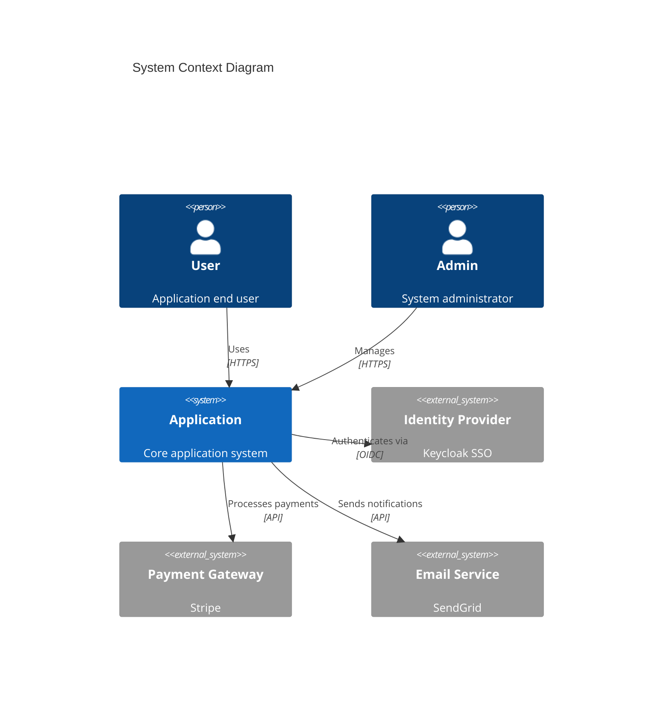
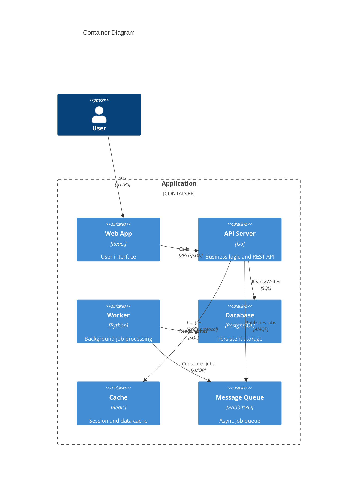
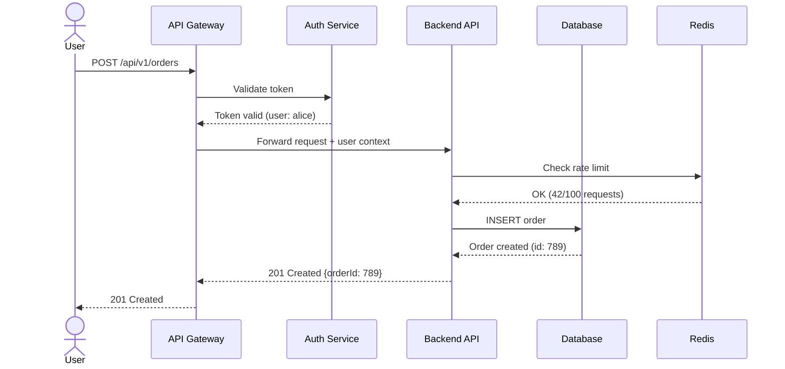
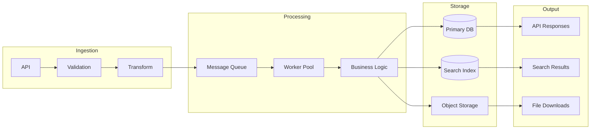
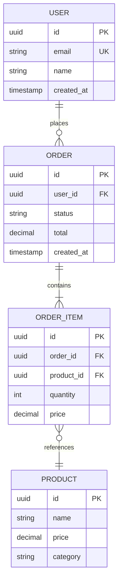
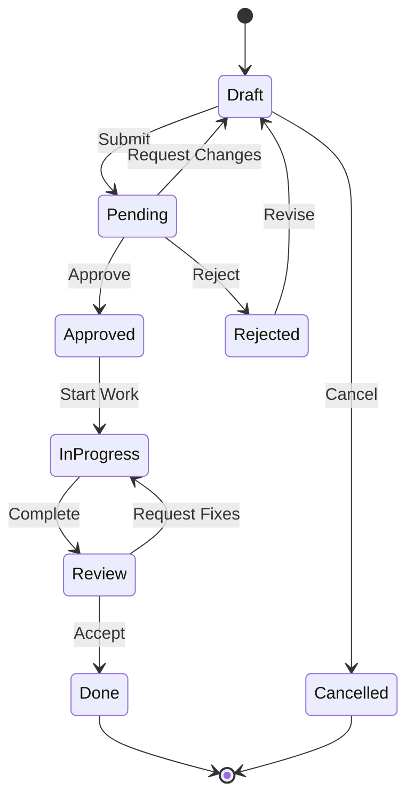
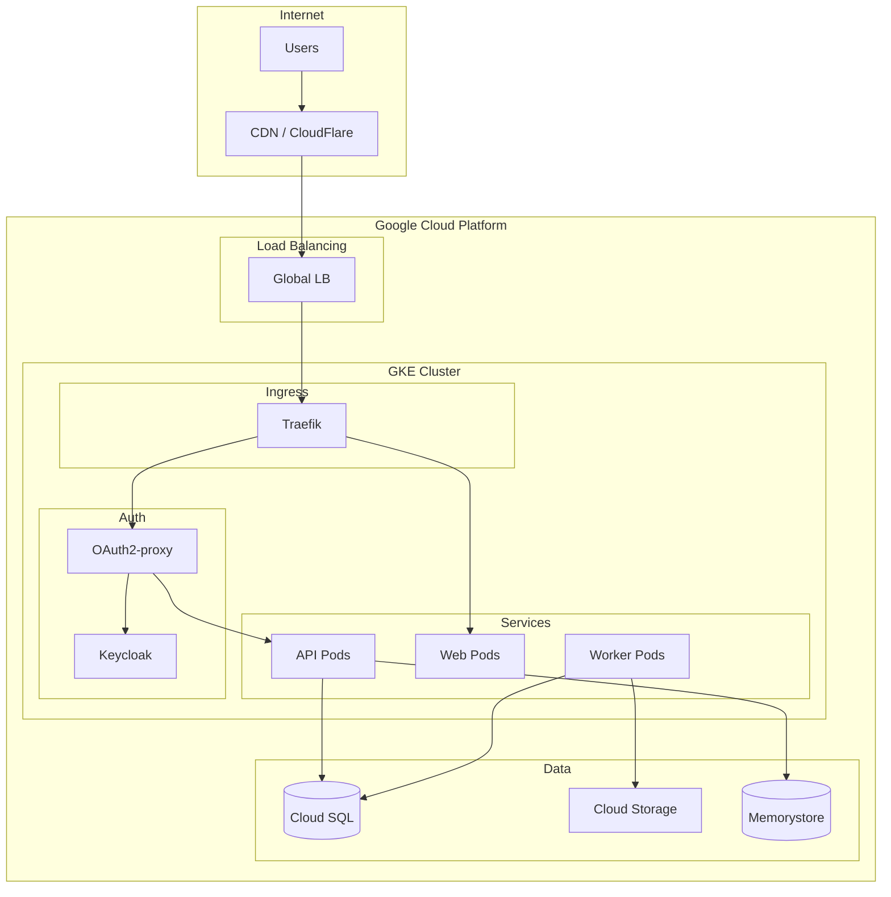
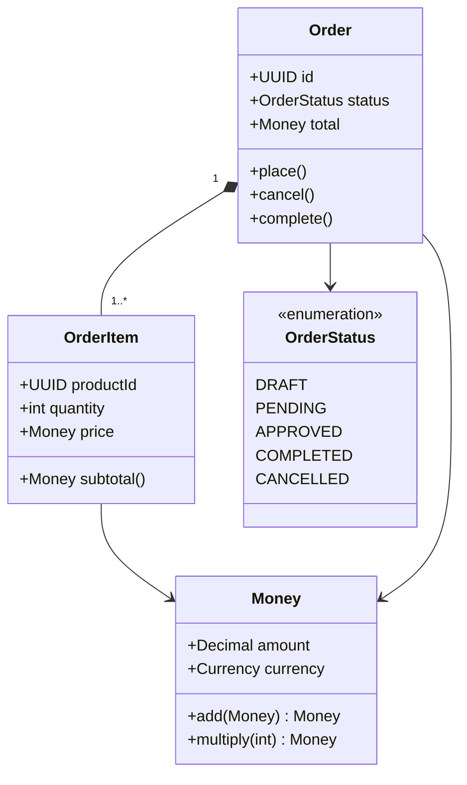

# Graph Generation

Generate any chart, graph, diagram, map, or visualization and save it as an image. This skill uses two rendering engines based on the type of graph:

| Engine | Best For | How it renders |
|---|---|---|
| **Mermaid** | Software diagrams (flowcharts, sequence, state, class, ER, C4, Gantt) | Mermaid MCP server (`mcp__mermaid__*`) renders to PNG |
| **D3.js** | Data-driven charts, maps, financial charts, network graphs, hierarchical visualizations | Self-contained HTML rendered via Playwright MCP, then screenshotted to PNG |

## Decision Guide

| You need... | Use |
|---|---|
| Flowchart, process diagram | Mermaid |
| Sequence diagram (API calls, interactions) | Mermaid |
| State machine / lifecycle | Mermaid |
| Class diagram / domain model | Mermaid |
| Entity-Relationship diagram | Mermaid |
| C4 architecture (Context, Container, Component) | Mermaid |
| Gantt chart / timeline | Mermaid |
| Bar / line / pie / scatter / histogram | D3 |
| Heatmap | D3 |
| Geographic map (choropleth, projections) | D3 |
| Candlestick / OHLC financial chart | D3 |
| Treemap / sunburst | D3 |
| Sankey / chord diagram | D3 |
| Force-directed network graph | D3 |
| Word cloud | D3 |

---

# Part 1: Mermaid Diagrams

Use the **mermaid MCP server** (`mcp__mermaid__*`) for creating and rendering software diagrams. Diagrams can be embedded in markdown documentation using fenced code blocks, or rendered to standalone PNG images via the MCP server.

## Mermaid Diagram Types

| Diagram Type | Use For |
|---|---|
| **Flowchart** | Decision logic, process flows, algorithms |
| **Sequence** | API calls, service interactions, request/response flows |
| **C4 Context** | System boundaries, external actors, high-level architecture |
| **C4 Container** | Services, databases, message queues within a system |
| **C4 Component** | Internal structure of a single service |
| **Entity-Relationship** | Database schemas, data models |
| **Class** | Object models, type hierarchies, domain models |
| **State** | Lifecycle states, status transitions, workflows |
| **Gantt** | Timelines, project phases, migration plans |
| **Architecture** (beta) | Cloud infrastructure, deployment topology |

## Mermaid Patterns

### System Overview (C4 Context)



### Service Architecture (C4 Container)



### API Request Flow (Sequence)



### Data Flow (Flowchart)



### Database Schema (ER Diagram)



### State Machine



### Deployment Architecture



### Class / Domain Model



## Mermaid Best Practices

1. **One diagram per concept** — don't overload a single diagram; split complex systems into multiple views
2. **Use consistent naming** — same service/component names across all diagrams
3. **Label relationships** — always annotate arrows with protocol, action, or data type
4. **Keep it readable** — limit to ~10-15 nodes per diagram; use subgraphs for grouping
5. **Use the MCP server** — validate diagram syntax before committing by using `mcp__mermaid__*` tools
6. **Match the audience** — C4 Context for stakeholders, Sequence for developers, ER for database teams
7. **Update diagrams with code** — when architecture changes, update the diagram in the same PR

---

# Part 2: D3.js Data Visualizations

Generate data-driven charts, maps, and visualizations as image files using **D3.js** rendered in a browser via **Playwright MCP**.

## D3 Workflow

Every D3 graph follows this 3-step process:

1. **Write a self-contained HTML file** with inline D3.js code (loaded from CDN)
2. **Open it in Playwright** using `mcp__playwright__browser_navigate`
3. **Screenshot it** using `mcp__playwright__browser_take_screenshot` to save as PNG

### Step 1: Write the HTML File

Create a single `.html` file with:
- D3.js loaded from CDN (`https://d3js.org/d3.v7.min.js`)
- Any additional D3 modules needed (e.g., `d3-sankey`, `topojson`)
- Inline data (JSON/CSV) or fetch from a URL
- SVG element sized to desired output dimensions
- White background explicitly set (screenshots default to transparent)

```html
<!DOCTYPE html>
<html>
<head>
  <meta charset="utf-8">
  <script src="https://d3js.org/d3.v7.min.js"></script>
  <style>
    body { margin: 0; background: white; }
    svg { display: block; }
  </style>
</head>
<body>
  <svg id="chart"></svg>
  <script>
    // D3 code here
  </script>
</body>
</html>
```

### Step 2: Open in Playwright

```
mcp__playwright__browser_navigate → file:///absolute/path/to/chart.html
```

### Step 3: Screenshot

```
mcp__playwright__browser_take_screenshot → saves PNG to desired output path
```

### Alternative: Extract SVG

Instead of a screenshot, extract the SVG markup directly:

```
mcp__playwright__browser_evaluate → document.querySelector('svg').outerHTML
```

Then write the returned SVG string to a `.svg` file.

## D3 Chart Patterns

### Bar Chart

```html
<!DOCTYPE html>
<html>
<head>
  <meta charset="utf-8">
  <script src="https://d3js.org/d3.v7.min.js"></script>
  <style>body { margin: 0; background: white; }</style>
</head>
<body>
<svg id="chart"></svg>
<script>
const data = [
  { label: "A", value: 30 },
  { label: "B", value: 80 },
  { label: "C", value: 45 },
  { label: "D", value: 60 },
  { label: "E", value: 20 }
];

const width = 600, height = 400;
const margin = { top: 20, right: 20, bottom: 40, left: 50 };

const svg = d3.select("#chart").attr("width", width).attr("height", height);

const x = d3.scaleBand()
  .domain(data.map(d => d.label))
  .range([margin.left, width - margin.right])
  .padding(0.2);

const y = d3.scaleLinear()
  .domain([0, d3.max(data, d => d.value)])
  .nice()
  .range([height - margin.bottom, margin.top]);

svg.selectAll("rect")
  .data(data).join("rect")
  .attr("x", d => x(d.label))
  .attr("y", d => y(d.value))
  .attr("width", x.bandwidth())
  .attr("height", d => y(0) - y(d.value))
  .attr("fill", "steelblue");

svg.append("g")
  .attr("transform", `translate(0,${height - margin.bottom})`)
  .call(d3.axisBottom(x));

svg.append("g")
  .attr("transform", `translate(${margin.left},0)`)
  .call(d3.axisLeft(y));
</script>
</body>
</html>
```

### Line Chart

```html
<!DOCTYPE html>
<html>
<head>
  <meta charset="utf-8">
  <script src="https://d3js.org/d3.v7.min.js"></script>
  <style>body { margin: 0; background: white; }</style>
</head>
<body>
<svg id="chart"></svg>
<script>
const data = [
  { date: "2024-01", value: 100 },
  { date: "2024-02", value: 130 },
  { date: "2024-03", value: 120 },
  { date: "2024-04", value: 170 },
  { date: "2024-05", value: 150 },
  { date: "2024-06", value: 200 }
];

const parseDate = d3.timeParse("%Y-%m");
data.forEach(d => d.date = parseDate(d.date));

const width = 600, height = 400;
const margin = { top: 20, right: 20, bottom: 40, left: 50 };

const svg = d3.select("#chart").attr("width", width).attr("height", height);

const x = d3.scaleTime()
  .domain(d3.extent(data, d => d.date))
  .range([margin.left, width - margin.right]);

const y = d3.scaleLinear()
  .domain([0, d3.max(data, d => d.value)])
  .nice()
  .range([height - margin.bottom, margin.top]);

const line = d3.line().x(d => x(d.date)).y(d => y(d.value));

svg.append("path")
  .datum(data)
  .attr("fill", "none")
  .attr("stroke", "steelblue")
  .attr("stroke-width", 2)
  .attr("d", line);

svg.append("g")
  .attr("transform", `translate(0,${height - margin.bottom})`)
  .call(d3.axisBottom(x).ticks(6));

svg.append("g")
  .attr("transform", `translate(${margin.left},0)`)
  .call(d3.axisLeft(y));
</script>
</body>
</html>
```

### Pie / Donut Chart

```html
<!DOCTYPE html>
<html>
<head>
  <meta charset="utf-8">
  <script src="https://d3js.org/d3.v7.min.js"></script>
  <style>body { margin: 0; background: white; }</style>
</head>
<body>
<svg id="chart"></svg>
<script>
const data = [
  { label: "Category A", value: 30 },
  { label: "Category B", value: 50 },
  { label: "Category C", value: 20 },
  { label: "Category D", value: 40 }
];

const width = 500, height = 500, radius = 200;
const innerRadius = 0; // Set > 0 for donut chart (e.g., 100)

const svg = d3.select("#chart")
  .attr("width", width).attr("height", height)
  .append("g")
  .attr("transform", `translate(${width/2},${height/2})`);

const color = d3.scaleOrdinal(d3.schemeTableau10);
const pie = d3.pie().value(d => d.value);
const arc = d3.arc().innerRadius(innerRadius).outerRadius(radius);

svg.selectAll("path")
  .data(pie(data)).join("path")
  .attr("d", arc)
  .attr("fill", (d, i) => color(i))
  .attr("stroke", "white")
  .attr("stroke-width", 2);

svg.selectAll("text")
  .data(pie(data)).join("text")
  .attr("transform", d => `translate(${arc.centroid(d)})`)
  .attr("text-anchor", "middle")
  .attr("font-size", "12px")
  .text(d => d.data.label);
</script>
</body>
</html>
```

### Scatter Plot

```html
<!DOCTYPE html>
<html>
<head>
  <meta charset="utf-8">
  <script src="https://d3js.org/d3.v7.min.js"></script>
  <style>body { margin: 0; background: white; }</style>
</head>
<body>
<svg id="chart"></svg>
<script>
const data = Array.from({ length: 50 }, () => ({
  x: Math.random() * 100,
  y: Math.random() * 100,
  r: Math.random() * 10 + 3
}));

const width = 600, height = 400;
const margin = { top: 20, right: 20, bottom: 40, left: 50 };

const svg = d3.select("#chart").attr("width", width).attr("height", height);

const x = d3.scaleLinear().domain([0, 100]).range([margin.left, width - margin.right]);
const y = d3.scaleLinear().domain([0, 100]).range([height - margin.bottom, margin.top]);

svg.selectAll("circle")
  .data(data).join("circle")
  .attr("cx", d => x(d.x))
  .attr("cy", d => y(d.y))
  .attr("r", d => d.r)
  .attr("fill", "steelblue")
  .attr("opacity", 0.6);

svg.append("g").attr("transform", `translate(0,${height - margin.bottom})`).call(d3.axisBottom(x));
svg.append("g").attr("transform", `translate(${margin.left},0)`).call(d3.axisLeft(y));
</script>
</body>
</html>
```

### Choropleth Map (World)

Requires TopoJSON data. Use the public world-110m dataset:

```html
<!DOCTYPE html>
<html>
<head>
  <meta charset="utf-8">
  <script src="https://d3js.org/d3.v7.min.js"></script>
  <script src="https://d3js.org/topojson.v3.min.js"></script>
  <style>body { margin: 0; background: white; }</style>
</head>
<body>
<svg id="chart"></svg>
<script>
const width = 960, height = 500;
const svg = d3.select("#chart").attr("width", width).attr("height", height);

const projection = d3.geoNaturalEarth1().scale(153).translate([width / 2, height / 2]);
const path = d3.geoPath().projection(projection);

// Example: color countries by random data
const color = d3.scaleSequential(d3.interpolateBlues).domain([0, 100]);

d3.json("https://cdn.jsdelivr.net/npm/world-atlas@2/countries-110m.json").then(world => {
  const countries = topojson.feature(world, world.objects.countries).features;

  svg.selectAll("path")
    .data(countries).join("path")
    .attr("d", path)
    .attr("fill", () => color(Math.random() * 100))
    .attr("stroke", "#ccc")
    .attr("stroke-width", 0.5);
});
</script>
</body>
</html>
```

**Map projections available:** `geoMercator`, `geoNaturalEarth1`, `geoOrthographic` (globe), `geoAlbersUsa` (US), `geoEquirectangular`, `geoStereographic`.

### Candlestick / OHLC (Financial)

```html
<!DOCTYPE html>
<html>
<head>
  <meta charset="utf-8">
  <script src="https://d3js.org/d3.v7.min.js"></script>
  <style>body { margin: 0; background: white; }</style>
</head>
<body>
<svg id="chart"></svg>
<script>
const data = [
  { date: "2024-01-02", open: 100, high: 110, low: 95, close: 108 },
  { date: "2024-01-03", open: 108, high: 115, low: 105, close: 103 },
  { date: "2024-01-04", open: 103, high: 112, low: 100, close: 110 },
  { date: "2024-01-05", open: 110, high: 118, low: 108, close: 115 },
  { date: "2024-01-08", open: 115, high: 120, low: 107, close: 109 },
  { date: "2024-01-09", open: 109, high: 114, low: 106, close: 113 },
  { date: "2024-01-10", open: 113, high: 119, low: 112, close: 117 }
];

const parseDate = d3.timeParse("%Y-%m-%d");
data.forEach(d => d.date = parseDate(d.date));

const width = 700, height = 400;
const margin = { top: 20, right: 20, bottom: 40, left: 60 };

const svg = d3.select("#chart").attr("width", width).attr("height", height);

const x = d3.scaleBand()
  .domain(data.map(d => d.date))
  .range([margin.left, width - margin.right])
  .padding(0.3);

const y = d3.scaleLinear()
  .domain([d3.min(data, d => d.low) - 5, d3.max(data, d => d.high) + 5])
  .range([height - margin.bottom, margin.top]);

// Wicks (high-low lines)
svg.selectAll(".wick")
  .data(data).join("line")
  .attr("x1", d => x(d.date) + x.bandwidth() / 2)
  .attr("x2", d => x(d.date) + x.bandwidth() / 2)
  .attr("y1", d => y(d.high))
  .attr("y2", d => y(d.low))
  .attr("stroke", d => d.close >= d.open ? "#26a69a" : "#ef5350");

// Bodies (open-close rects)
svg.selectAll(".body")
  .data(data).join("rect")
  .attr("x", d => x(d.date))
  .attr("y", d => y(Math.max(d.open, d.close)))
  .attr("width", x.bandwidth())
  .attr("height", d => Math.max(1, Math.abs(y(d.open) - y(d.close))))
  .attr("fill", d => d.close >= d.open ? "#26a69a" : "#ef5350");

svg.append("g")
  .attr("transform", `translate(0,${height - margin.bottom})`)
  .call(d3.axisBottom(x).tickFormat(d3.timeFormat("%b %d")));

svg.append("g")
  .attr("transform", `translate(${margin.left},0)`)
  .call(d3.axisLeft(y));
</script>
</body>
</html>
```

### Treemap

```html
<!DOCTYPE html>
<html>
<head>
  <meta charset="utf-8">
  <script src="https://d3js.org/d3.v7.min.js"></script>
  <style>body { margin: 0; background: white; }</style>
</head>
<body>
<svg id="chart"></svg>
<script>
const data = {
  name: "root",
  children: [
    { name: "Frontend", value: 40 },
    { name: "Backend", value: 35 },
    { name: "Database", value: 20 },
    { name: "DevOps", value: 15 },
    { name: "Testing", value: 10 }
  ]
};

const width = 600, height = 400;
const svg = d3.select("#chart").attr("width", width).attr("height", height);
const color = d3.scaleOrdinal(d3.schemeTableau10);

const root = d3.hierarchy(data).sum(d => d.value);
d3.treemap().size([width, height]).padding(2)(root);

const nodes = svg.selectAll("g")
  .data(root.leaves()).join("g")
  .attr("transform", d => `translate(${d.x0},${d.y0})`);

nodes.append("rect")
  .attr("width", d => d.x1 - d.x0)
  .attr("height", d => d.y1 - d.y0)
  .attr("fill", (d, i) => color(i));

nodes.append("text")
  .attr("x", 5).attr("y", 20)
  .attr("font-size", "13px").attr("fill", "white")
  .text(d => d.data.name);
</script>
</body>
</html>
```

### Sankey Diagram

Requires the `d3-sankey` module:

```html
<!DOCTYPE html>
<html>
<head>
  <meta charset="utf-8">
  <script src="https://d3js.org/d3.v7.min.js"></script>
  <script src="https://cdn.jsdelivr.net/npm/d3-sankey@0.12/dist/d3-sankey.min.js"></script>
  <style>body { margin: 0; background: white; }</style>
</head>
<body>
<svg id="chart"></svg>
<script>
const width = 700, height = 400;
const svg = d3.select("#chart").attr("width", width).attr("height", height);

const data = {
  nodes: [
    { name: "Source A" }, { name: "Source B" },
    { name: "Process 1" }, { name: "Process 2" },
    { name: "Output X" }, { name: "Output Y" }
  ],
  links: [
    { source: 0, target: 2, value: 20 },
    { source: 0, target: 3, value: 10 },
    { source: 1, target: 2, value: 15 },
    { source: 1, target: 3, value: 25 },
    { source: 2, target: 4, value: 30 },
    { source: 3, target: 4, value: 10 },
    { source: 3, target: 5, value: 25 }
  ]
};

const sankey = d3.sankey()
  .nodeWidth(20).nodePadding(10)
  .extent([[10, 10], [width - 10, height - 10]]);

const { nodes, links } = sankey(data);
const color = d3.scaleOrdinal(d3.schemeTableau10);

svg.selectAll("rect")
  .data(nodes).join("rect")
  .attr("x", d => d.x0).attr("y", d => d.y0)
  .attr("width", d => d.x1 - d.x0)
  .attr("height", d => d.y1 - d.y0)
  .attr("fill", (d, i) => color(i));

svg.selectAll(".link")
  .data(links).join("path")
  .attr("d", d3.sankeyLinkHorizontal())
  .attr("fill", "none")
  .attr("stroke", (d, i) => color(d.source.index))
  .attr("stroke-width", d => d.width)
  .attr("stroke-opacity", 0.4);

svg.selectAll("text")
  .data(nodes).join("text")
  .attr("x", d => d.x0 < width / 2 ? d.x1 + 6 : d.x0 - 6)
  .attr("y", d => (d.y0 + d.y1) / 2)
  .attr("dy", "0.35em")
  .attr("text-anchor", d => d.x0 < width / 2 ? "start" : "end")
  .attr("font-size", "12px")
  .text(d => d.name);
</script>
</body>
</html>
```

### Heatmap

```html
<!DOCTYPE html>
<html>
<head>
  <meta charset="utf-8">
  <script src="https://d3js.org/d3.v7.min.js"></script>
  <style>body { margin: 0; background: white; }</style>
</head>
<body>
<svg id="chart"></svg>
<script>
const rows = ["Mon", "Tue", "Wed", "Thu", "Fri"];
const cols = ["9am", "10am", "11am", "12pm", "1pm", "2pm", "3pm", "4pm", "5pm"];
const data = [];
rows.forEach((row, i) => cols.forEach((col, j) => {
  data.push({ row, col, value: Math.random() * 100 });
}));

const width = 600, height = 350;
const margin = { top: 20, right: 20, bottom: 40, left: 60 };

const svg = d3.select("#chart").attr("width", width).attr("height", height);

const x = d3.scaleBand().domain(cols).range([margin.left, width - margin.right]).padding(0.05);
const y = d3.scaleBand().domain(rows).range([margin.top, height - margin.bottom]).padding(0.05);
const color = d3.scaleSequential(d3.interpolateYlOrRd).domain([0, 100]);

svg.selectAll("rect")
  .data(data).join("rect")
  .attr("x", d => x(d.col)).attr("y", d => y(d.row))
  .attr("width", x.bandwidth()).attr("height", y.bandwidth())
  .attr("fill", d => color(d.value));

svg.append("g").attr("transform", `translate(0,${height - margin.bottom})`).call(d3.axisBottom(x));
svg.append("g").attr("transform", `translate(${margin.left},0)`).call(d3.axisLeft(y));
</script>
</body>
</html>
```

### Force-Directed Network Graph

```html
<!DOCTYPE html>
<html>
<head>
  <meta charset="utf-8">
  <script src="https://d3js.org/d3.v7.min.js"></script>
  <style>body { margin: 0; background: white; }</style>
</head>
<body>
<svg id="chart"></svg>
<script>
const nodes = [
  { id: "API Gateway" }, { id: "Auth Service" },
  { id: "User Service" }, { id: "Order Service" },
  { id: "Payment Service" }, { id: "Database" },
  { id: "Cache" }, { id: "Queue" }
];

const links = [
  { source: "API Gateway", target: "Auth Service" },
  { source: "API Gateway", target: "User Service" },
  { source: "API Gateway", target: "Order Service" },
  { source: "Order Service", target: "Payment Service" },
  { source: "Order Service", target: "Database" },
  { source: "User Service", target: "Database" },
  { source: "User Service", target: "Cache" },
  { source: "Order Service", target: "Queue" }
];

const width = 600, height = 500;
const svg = d3.select("#chart").attr("width", width).attr("height", height);
const color = d3.scaleOrdinal(d3.schemeTableau10);

const simulation = d3.forceSimulation(nodes)
  .force("link", d3.forceLink(links).id(d => d.id).distance(100))
  .force("charge", d3.forceManyBody().strength(-300))
  .force("center", d3.forceCenter(width / 2, height / 2));

const link = svg.selectAll("line")
  .data(links).join("line")
  .attr("stroke", "#999").attr("stroke-width", 2);

const node = svg.selectAll("circle")
  .data(nodes).join("circle")
  .attr("r", 20)
  .attr("fill", (d, i) => color(i));

const label = svg.selectAll("text")
  .data(nodes).join("text")
  .attr("text-anchor", "middle")
  .attr("dy", 35)
  .attr("font-size", "11px")
  .text(d => d.id);

// Run simulation synchronously for static output
simulation.tick(300);

link.attr("x1", d => d.source.x).attr("y1", d => d.source.y)
    .attr("x2", d => d.target.x).attr("y2", d => d.target.y);
node.attr("cx", d => d.x).attr("cy", d => d.y);
label.attr("x", d => d.x).attr("y", d => d.y);
</script>
</body>
</html>
```

**Important:** For static image output, run the simulation synchronously with `simulation.tick(300)` so the layout is fully resolved before screenshot.

## Additional D3 Modules (CDN)

Load these as needed for specialized chart types:

| Module | CDN URL | Use For |
|---|---|---|
| `d3-sankey` | `https://cdn.jsdelivr.net/npm/d3-sankey@0.12/dist/d3-sankey.min.js` | Sankey diagrams |
| `d3-cloud` | `https://cdn.jsdelivr.net/npm/d3-cloud@1/build/d3.layout.cloud.js` | Word clouds |
| `d3-hexbin` | `https://cdn.jsdelivr.net/npm/d3-hexbin@0.2/build/d3-hexbin.min.js` | Hexagonal binning |
| `topojson` | `https://d3js.org/topojson.v3.min.js` | Map data (TopoJSON) |
| `d3-contour` | included in d3.v7 | Contour/density plots |
| `d3-hierarchy` | included in d3.v7 | Treemaps, sunbursts, dendrograms |
| `d3-force` | included in d3.v7 | Force-directed graphs |
| `d3-geo` | included in d3.v7 | Map projections |

## Sizing and Resolution

- Default chart size: `width=800, height=500` for landscape charts
- Maps: `width=960, height=500` (standard for world maps)
- Square charts (pie, network): `width=600, height=600`
- For high-DPI output, set Playwright viewport to 2x dimensions and use `deviceScaleFactor: 2`

## Color Schemes

D3 provides built-in color schemes:

| Scheme | Best For |
|---|---|
| `d3.schemeTableau10` | Categorical data (default choice) |
| `d3.schemeCategory10` | Categorical data (alternative) |
| `d3.interpolateBlues` | Sequential single-hue |
| `d3.interpolateViridis` | Sequential multi-hue (colorblind-safe) |
| `d3.interpolateRdYlGn` | Diverging (red-yellow-green) |
| `d3.interpolateSpectral` | Diverging (spectral) |
| `d3.interpolateYlOrRd` | Sequential warm (heatmaps) |

## D3 Tips

1. **Always set `background: white`** on body — Playwright screenshots default to transparent
2. **Run force simulations synchronously** with `.tick(N)` for static output
3. **Use `d3.format`** for axis tick formatting (e.g., `d3.format(",.0f")` for thousands separators)
4. **Add titles/labels** — standalone chart images need context that surrounding documentation would otherwise provide
5. **Test the HTML locally** in a browser before screenshotting if the chart is complex
6. **For maps, always load data asynchronously** — use `d3.json()` for TopoJSON/GeoJSON data
7. **Wrap chart code in `async` IIFE** when using `await d3.json()` or `await d3.csv()` for external data
