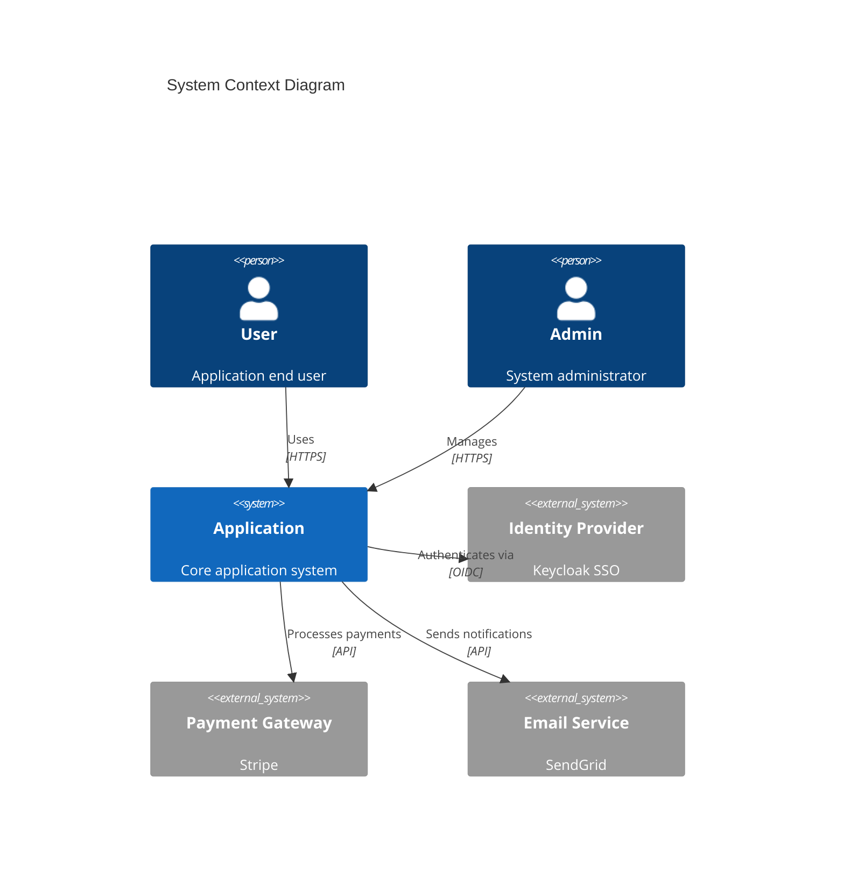
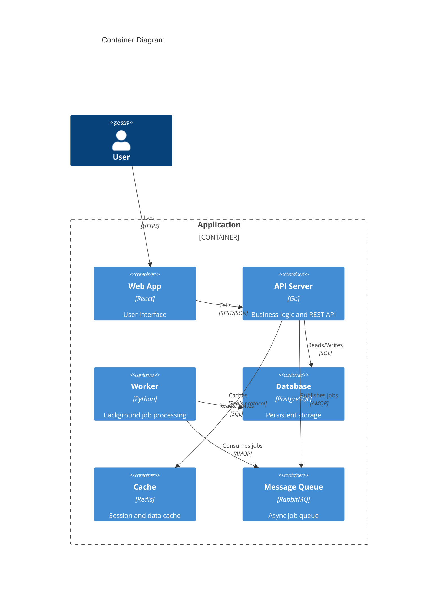
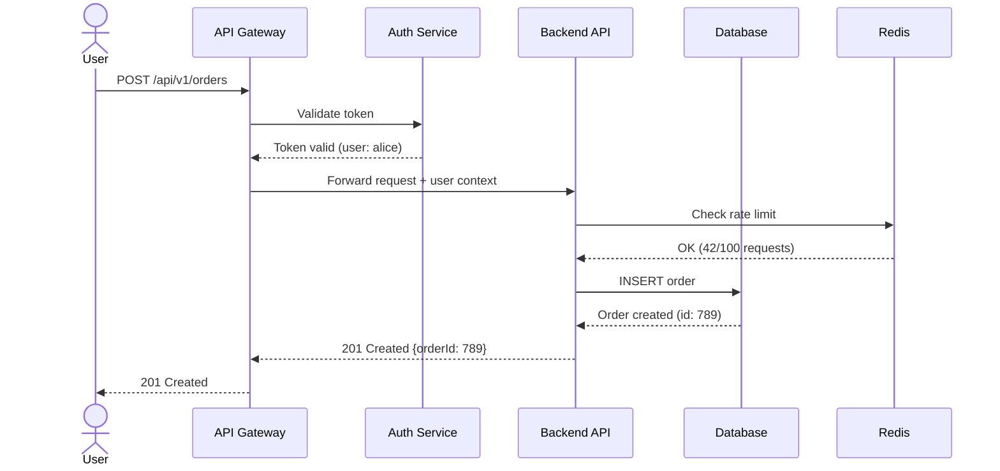
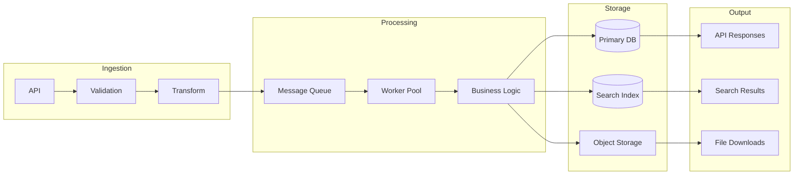
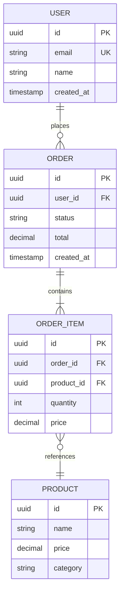
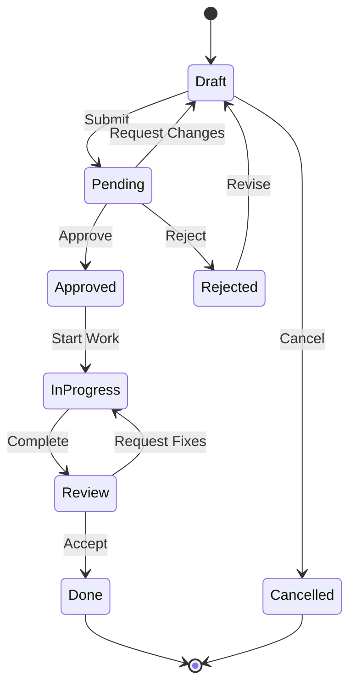
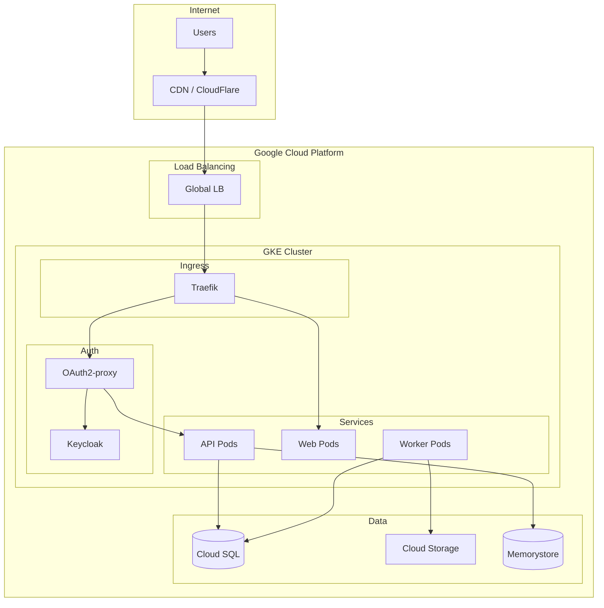
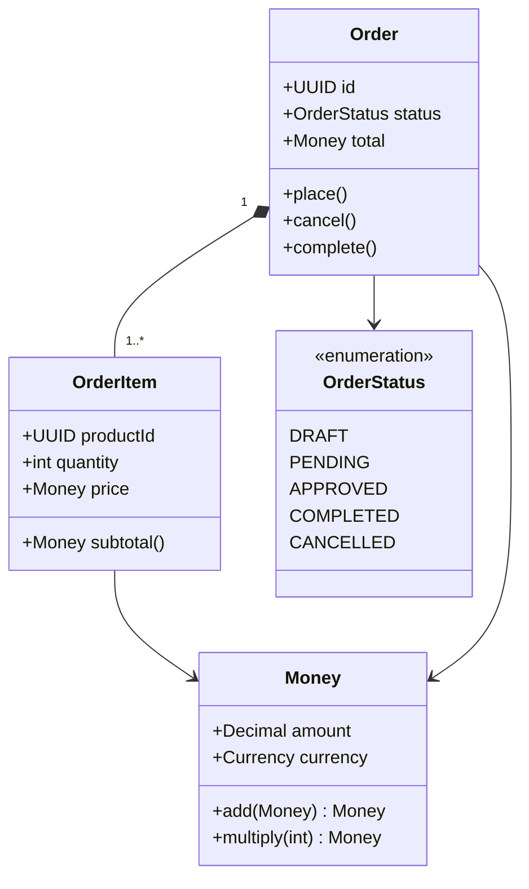

# Mermaid Diagrams for Documentation

Always use the **mermaid MCP server** (`mcp__mermaid__*`) for creating and validating diagrams. Embed diagrams directly in markdown documentation using fenced code blocks.

## When to Use Which Diagram Type

| Diagram Type | Use For |
|---|---|
| **Flowchart** | Decision logic, process flows, algorithms |
| **Sequence** | API calls, service interactions, request/response flows |
| **C4 Context** | System boundaries, external actors, high-level architecture |
| **C4 Container** | Services, databases, message queues within a system |
| **C4 Component** | Internal structure of a single service |
| **Entity-Relationship** | Database schemas, data models |
| **Class** | Object models, type hierarchies, domain models |
| **State** | Lifecycle states, status transitions, workflows |
| **Gantt** | Timelines, project phases, migration plans |
| **Architecture** (beta) | Cloud infrastructure, deployment topology |

## Diagram Patterns

### System Overview (C4 Context)

Use for `docs/architecture/system-overview.md`:

### Service Architecture (C4 Container)

Use for detailed architecture docs:

### API Request Flow (Sequence)

Use for `docs/features/<feature>/design.md`:

### Data Flow

Use for `docs/architecture/data-flow.md`:

### Database Schema (ER Diagram)

Use for data model documentation:

### State Machine

Use for workflow/lifecycle documentation:

### Deployment Architecture

Use for `docs/architecture/infrastructure.md`:

### Class / Domain Model

Use for domain-driven design documentation:

## Best Practices

1. **One diagram per concept** — don't overload a single diagram; split complex systems into multiple views
2. **Use consistent naming** — same service/component names across all diagrams
3. **Label relationships** — always annotate arrows with protocol, action, or data type
4. **Keep it readable** — limit to ~10-15 nodes per diagram; use subgraphs for grouping
5. **Use the MCP server** — validate diagram syntax before committing by using `mcp__mermaid__*` tools
6. **Match the audience** — C4 Context for stakeholders, Sequence for developers, ER for database teams
7. **Update diagrams with code** — when architecture changes, update the diagram in the same PR
